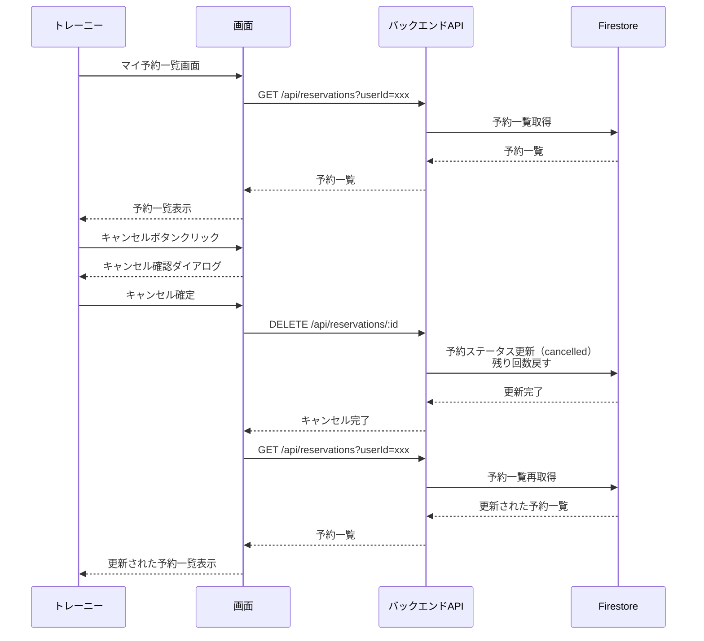

# 画面遷移図

## トレーニー（顧客）向け画面遷移

## トレーナー向け画面遷移

## 主要なユーザーフロー

### フロー1: プラン購入から予約まで

### フロー2: カルテ記録

### フロー3: 予約キャンセル

## 画面一覧（URLマッピング）

### トレーニー向け
- `/login.html` - ログイン/新規登録画面
- `/` または `/index.html` - 予約一覧/カレンダー画面
- `/reservation/new` - 予約作成画面
- `/mypage` - マイページ
- `/my-reservations` - マイ予約一覧画面
- `/charts` - カルテ閲覧画面
- `/plans/purchase` - プラン購入画面
- `/payment` - 決済画面
- `/payment/complete` - 決済完了画面
- `/payment/history` - 決済履歴画面

### トレーナー向け
- `/trainer/login` - トレーナーログイン画面
- `/trainer/dashboard` - 予約管理画面（ダッシュボード）
- `/trainer/reservations/:id` - 予約詳細画面
- `/trainer/charts/new` - カルテ記録画面
- `/trainer/charts/:id/edit` - カルテ編集画面
- `/trainer/customers` - 顧客管理画面
- `/trainer/customers/:id` - 顧客詳細画面
- `/trainer/plans` - プラン管理画面
- `/trainer/menus` - メニュー管理画面
- `/trainer/payments` - 決済管理画面

