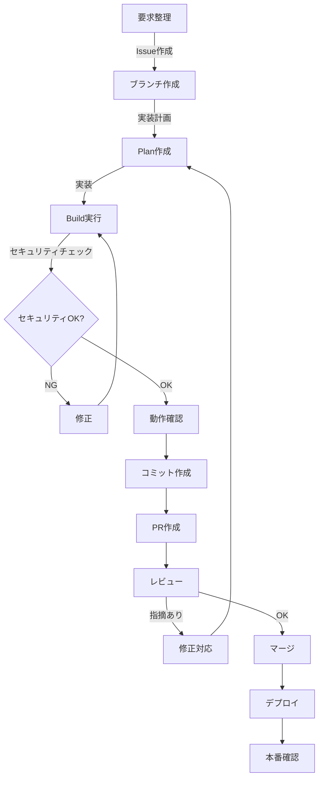

# 開発ワークフロー全体像

このドキュメントでは、CursorとClaude Codeを使用した開発フローの全体像を説明します。

## ワークフローの全体像

## 各ステップの詳細

### 1. 要求整理フロー

**目的:** 実装すべき機能や修正すべき問題を明確にする

**手順:**
1. `/github:issue-from-request` でIssueを作成
2. Issueの内容を確認・調整

**成果物:**
- GitHub Issue

**所要時間:** 5-10分

---

### 2. 初版作成フロー

#### 2.1 ブランチ作成

**目的:** 機能ごとに独立したブランチで作業する

**手順:**
1. `/github:branch-create {issue番号}` でブランチ作成
2. ブランチをcheckout

**成果物:**
- フィーチャーブランチ

**所要時間:** 1分

#### 2.2 実装計画

**目的:** 実装手順を明確にして、効率的に実装する

**手順:**
1. CursorのPlanモードを使用
2. 実装計画を作成
3. セキュリティチェックリストを確認（`SECURITY_CHECKLIST.md`）

**成果物:**
- 実装計画（`.cursor/plans/` 配下）

**所要時間:** 10-30分

#### 2.3 実装実行

**目的:** 計画に基づいて実装する

**手順:**
1. CursorのBuildモードを使用
2. Planに基づいて実装
3. セキュリティ設定を確認
4. 動作確認

**成果物:**
- 実装されたコード

**所要時間:** 30分-数時間（機能の複雑さによる）

#### 2.4 コミット作成

**目的:** 変更をコミットしてバージョン管理する

**手順:**
1. `git add` で変更をステージング
2. `/github:commit-single` でコミット作成
3. `git push` でリモートにプッシュ

**成果物:**
- Gitコミット

**所要時間:** 2-3分

#### 2.5 プルリクエスト作成

**目的:** コードレビューとマージのためにPRを作成

**手順:**
1. `/github:pull-request-create main` でPR作成
2. Issueとの差分を確認

**成果物:**
- GitHub Pull Request

**所要時間:** 3-5分

---

### 3. レビュー対応フロー

#### 3.1 レビュー実施

**目的:** コードの品質とセキュリティを確認

**手順:**
1. `/github:pull-request-review` でレビュー実施
2. レビュー観点：
   - コードの品質
   - セキュリティ設定
   - ドキュメントの更新
   - 冗長性の有無

**成果物:**
- レビューコメント

**所要時間:** 10-20分

#### 3.2 レビュー対応

**目的:** レビュー指摘事項に対応する

**手順:**
1. 指摘事項を確認
2. Planモードで修正計画を作成
3. Buildモードで修正を実施
4. 動作確認
5. コミット作成
6. 再レビュー（指摘がなくなるまで繰り返し）

**成果物:**
- 修正されたコード

**所要時間:** 30分-数時間（指摘の内容による）

---

### 4. マージとデプロイ

#### 4.1 マージ

**目的:** mainブランチに変更を統合

**手順:**
1. レビューが完了したらマージ
2. Issueが自動的にクローズされることを確認

**成果物:**
- mainブランチへの統合

**所要時間:** 1分

#### 4.2 デプロイ

**目的:** 本番環境に変更を反映

**手順:**
1. GitHub Actionsで自動デプロイ（Cloud Run）
2. デプロイが成功したことを確認
3. 本番環境で動作確認
4. セキュリティ設定が適切か確認

**成果物:**
- デプロイされたアプリケーション

**所要時間:** 5-10分（デプロイ時間による）

---

## カスタムコマンド一覧

| コマンド | 用途 | 使用頻度 | 所要時間 |
|---------|------|---------|---------|
| `/github:issue-from-request` | Issue作成 | 低 | 5分 |
| `/github:branch-create` | ブランチ作成 | 中 | 1分 |
| `/github:commit-single` | コミット作成 | 高 | 2分 |
| `/github:pull-request-create` | PR作成 | 中 | 3分 |
| `/github:pull-request-review` | PRレビュー | 中 | 15分 |
| `/security:check` | セキュリティチェック | 高 | 10分 |

## よくあるミスと対策

### ミス1: セキュリティ設定の見落とし

**発生タイミング:** 実装中

**問題:** CORS設定で `allow_origins=["*"]` のまま本番環境にデプロイ

**対策:** 
- 実装前に `/security:check` を実行
- `SECURITY_CHECKLIST.md` を確認

### ミス2: ブランチを作成せずにmainで作業

**発生タイミング:** 実装開始時

**問題:** mainブランチで直接実装してしまう

**対策:** 
- 実装前に必ず `/github:branch-create` を実行
- ワークフロードキュメントを確認

### ミス3: コミットメッセージが不適切

**発生タイミング:** コミット時

**問題:** コミットメッセージが曖昧

**対策:** 
- `/github:commit-single` を使用してConventional Commit形式を遵守

### ミス4: ドキュメント未更新

**発生タイミング:** PRレビュー時

**問題:** コード変更したがドキュメントを更新していない

**対策:** 
- レビュー時に `docs/` 配下の更新も確認
- PR作成時にドキュメント更新を確認

## メトリクス（分析可能な形式）

### 開発サイクル時間

| ステップ | 平均所要時間 | 目標時間 |
|---------|------------|---------|
| Issue作成 | 5-10分 | 5分 |
| ブランチ作成 | 1分 | 1分 |
| 実装計画 | 10-30分 | 20分 |
| 実装実行 | 30分-数時間 | 1-2時間 |
| コミット作成 | 2-3分 | 2分 |
| PR作成 | 3-5分 | 3分 |
| レビュー | 10-20分 | 15分 |
| レビュー対応 | 30分-数時間 | 1時間 |
| マージ・デプロイ | 5-10分 | 5分 |

### 品質指標

- **レビュー回数:** 平均1-2回
- **セキュリティチェック通過率:** 目標100%
- **ドキュメント更新率:** 目標100%

## 改善ポイント

### 短期的な改善

1. **セキュリティチェックの自動化**
   - CI/CDパイプラインにセキュリティチェックを追加
   - 自動的にセキュリティ問題を検出

2. **テンプレートの整備**
   - Issueテンプレート
   - PRテンプレート
   - コミットメッセージテンプレート

### 長期的な改善

1. **メトリクスの可視化**
   - 開発サイクル時間の追跡
   - コード品質指標の可視化

2. **ベストプラクティスの継続的な更新**
   - 新しいセキュリティ脅威への対応
   - 技術スタックの更新に伴うベストプラクティスの見直し

## 関連ドキュメント

- `DEVELOPMENT_WORKFLOW.md` - 詳細な開発フロー
- `SECURITY_CHECKLIST.md` - セキュリティチェックリスト
- `CUSTOM_COMMANDS_SETUP.md` - カスタムコマンドの設定方法
- `GCP_SETUP_CHECKLIST.md` - GCP設定チェックリスト

